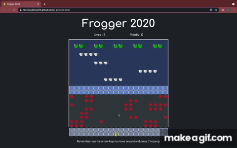
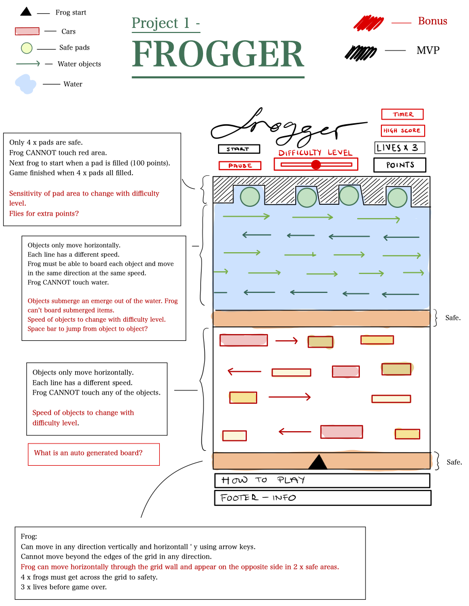

# Frogger:2020



[Play frogger:2020](https://lesroissamusent.github.io/Frogger-2020/)

## Table of contents: 
* [Brief](#brief)
* [Requirements](#requirements)
* [Timeframe](#timeframe)
* [Technologies Used](#technologies-used)
* [Process](#process)
  * [Planning](#planning)
  * [Game Logic](#game-logic)
  * [Styling](#styling)
  * [Challenges](#challenges)
  * [Wins](#wins)
* [Future Features](#future-features)
* [Key Learnings](#key-learnings)

## Brief:
The idea of Frogger is to guide a family of frogs across a road, and a river to their homes at the top of the screen. To make things more challenging there are numerous moving obstacles that the frogs must avoid to reach their destination.

## Requirements: 
1. The game should be playable by one player.

2. The obstacles should be auto generated.

3. The game should be styled.

## Timeframe:
1 week

## Technologies Used:
Javascript (ES6)

HTML5

CSS

VSCode 

Git & GitHub

## Process
### Planning
We were given a list of 11 games to choose from. I made my decision based on the difficulty level of the code as well as my personal interest in playing the game. I wanted to have a project that I would want to revisit once completed. 

We were required to present a wireframe as well as some basic pseudocoding before being signed off by the instructional team. We were not allowed to write any *actual* code before sign-off. 

**WireFrame and Plan for Sign-off (Including MVP and Bonus Features)**




### Game Logic

**Creating a grid**
```js
// Make a grid
  function createGrid() {
    for (let i = 0; i < cellCount; i++) {
      const cell = document.createElement('div')
      // cell.textContent = i // innerText
      grid.appendChild(cell)
      cells.push(cell) // add cells to array 'cells'
    }
    for (let i = 0; i < 220; i++) {
      waterCells.push(i)
    }
    for (let i = 220; i < 260; i++) {
      waterSafetyCells.push(i)
    }
    for (let i = 260; i < 420; i++) {
      roadCells.push(i)
    }
    for (let i = 420; i < 460; i++) {
      roadSafetyCells.push(i)
    }

    addSafetyPads(safetyPadCells)
    addFrog(frogStartPosition)
    addWater(waterCells)
    addWaterSafety(waterSafetyCells)
    addRoad(roadCells)
    addRoadSafety(roadSafetyCells)
```

**Moving the frog**
```js
// Move frog
  function handleKeyDown(event) {
    const key = event.keyCode 

    // * 1. remove frog
    removeFrog(frogCurrentPosition) 

    // * 2. check  what key has been pressed to decide where frog should go
    if (key === 39/*right*/ && frogCurrentPosition % width !== width - 1) { 
      frogCurrentPosition++
    } else if (key === 37/*left*/ && frogCurrentPosition % width !== 0) {
      frogCurrentPosition--
    } else if (key === 38/*up*/ && frogCurrentPosition >= width) {
      frogCurrentPosition -= width
      points += 5
    } else if (key === 40/*down*/ && frogCurrentPosition + width <= width * height - 1) {
      frogCurrentPosition += width
    } else if (key === 74/*J*/ && frogCurrentPosition - height !== 0) {
      frogCurrentPosition -= width * 2
      points += 10
    } else {
      console.log('Illegal move')
    }
    // * 3. add frog to new position
    addFrog(frogCurrentPosition)
    myPoints.innerHTML = points
    console.log('frog!', frogCurrentPosition)
  }
```

**Creating moving obstacles**
```js
  // * OBSTACLESSSSSS
  const obstacleClass = 'obstacles'

  let obstacleArrayOne = [261, 262, 281, 282, 290, 291, 276, 277, 278]
  let obstacleArrayTwo = [319, 318, 317, 339, 338, 337, 312, 313, 332, 333, 325, 324, 300, 301]
  let obstacleArrayThree = [340, 341, 360, 361, 370, 371, 377]
  let obstacleArrayFour = [382, 383, 384, 384, 388, 402, 403, 404, 399, 398, 397, 419, 418, 417]

  function removeObstacles(position) {
    cells[position].classList.remove(obstacleClass)
  }

  function addObstacles(position) {
    cells[position].classList.add(obstacleClass)
  }

  function obstacleRowOneTimer() {
    
    setInterval(() => {
      obstacleArrayOne.forEach((index) => {
        removeObstacles(index) 
      })

      obstacleArrayOne = obstacleArrayOne.map((index) => {
        if ((index + 1) % width === 0) {
          return index - (width - 1)
        } else {
          return index + 1
        } 
      })
      obstacleArrayOne.forEach((index) => {
        addObstacles(index) 
        gameRules()
      })
    }, 300)
  }
```

**Detecting collisions**
```js
  // OBSTACLES
    } else if (cells[frogCurrentPosition].classList.contains('obstacles')) {
      console.log('ouch')
      removeFrog(frogCurrentPosition) 
      addFrog(frogStartPosition)
      frogCurrentPosition = 449
      lives -= 1
      points -= 10
      console.log('points', points)
    }
```

**Creating safe objects**
```js
// * OBJECTSSSSSS
  const objectClass = 'objects'

  let objectArrayOne = [60, 61, 62, 63]
  let objectArrayTwo = [106, 107, 108]
  let objectArrayThree = [153, 154, 155, 156]
  let objectArrayFour = [188, 189, 190, 191]

  function removeObjects(position) { 
    cells[position].classList.remove(objectClass)
  }
  function addObjects(position) {
    cells[position].classList.add(objectClass)
  }
  function objectRowOneTimer() {
    setInterval(() => {
      objectArrayOne.forEach((index) => {
        removeObjects(index) 
      })

      objectArrayOne = objectArrayOne.map((index) => {
        if ((index + 1) % width === 0) {
          return index - (width - 1)
        } else {
          return index + 1
        } 
      })
      objectArrayOne.forEach((index) => {
        addObjects(index) 
      })
    }, 300)
  }
```

**Reaching safety**
```js
  // SAFETYPADS
    } else if (cells[frogCurrentPosition].classList.contains('water') && cells[frogCurrentPosition].classList.contains('safety-pads')) {
      removeFrog(frogCurrentPosition) 
      addFrog(frogStartPosition)
      frogCurrentPosition = 449
      points += 50
```

**Gameover and reset**
```js
function gameOver() {
    header.classList.add('hidden')
    main.classList.add('hidden')
    footer.classList.add('hidden')
    finalScore.innerHTML = points
    console.log('final points', points)
    gameEnd.classList.remove('hidden')
  }
  function resetGame() {
    window.location.reload()
  }
```


### Styling
* I wanted the game to have a playful look but also be comfortable to play on a large screen. I decided to go for darker colors so as not to strain the eyes of the player. 
* I decided, as this was my first project, that I should not decide on any styling elements until I was able to play around with the CSS once my MVP was completed. I wanted to give myself the freedom to try new things without being constrained by my planning which is why the end product doesn’t resemble the wireframe too much. 

### Challenges
* The most difficult part of this project turned out to be the logic behind obstacles and objects. I was able to add classes where needed but getting the frog to react to collisions with the classes was more difficult. 
* In the end I ran out of time before figuring out how to get the frog to attach itself to the face masks on the water. When the frog jumps on to a mask it should travel in the same direction as the mask and at the same speed until it either reaches the edge of the grid (and dies) or the player moves it to a different mask.

### Wins
* Cracking the collision logic on the viruses was extremely satisfying. 
I love the end result of the styling, this was the first time I really enjoyed CSS and felt like I’d done a good job. 
* This was my first opportunity to work at my own pace and for multiple consecutive days on the same project. I really enjoyed completing the project and knowing that I had done this all on my own. 

## Future Features
If I were to revisit this project, there are a few features I would want to add: 
* A toggle at the top of the page where the player can decide whether they want the game to assist them to stay on the masks or not. 
* A leaderboard that keeps track of highscores.  

## Key Learnings
* Completing a project from start to finish
* Using JavaScript in a logic driven way
* Getting more familiar with CSS
